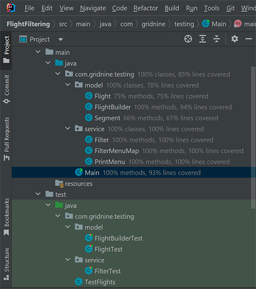

## FlightFiltering

Модуль для фильтрации перелётов.

*Перелёт* — это перевозка пассажира из одной точки в другую с возможными промежуточными посадками. Его можно представить как набор из одного или нескольких элементарных перемещений, называемых сегментами. 
*Сегмент* — это атомарная перевозка, которая задана двумя атрибутами: дата и время вылета и дата и время прилёта.
### Технологии
Проект написан на Java, c применением Stream API. 
Для тестирования используется JUnit 5.

### Функционал
Раелизовано три фильтра, исключающие из набора перелёты по следующим правилам:
1. вылет произощёл до текущего момента времени;
2. имеются сегменты с датой прилёта раньше даты вылета;
3. общее время, проведённое на земле превышает два часа.

Правила могут выбираться и задаваться динамически, с помощью меню, в консоли. Отфильтрованные перелёты также выводятся в консоль. 
Предполагается, что модуль может расширяться, правил фильтрации может быть очень много. 
Также и наборы перелётов могут быть очень большими. 

### Тесты
Код покрыт тестами, используется библиотека JUnit 5.  

