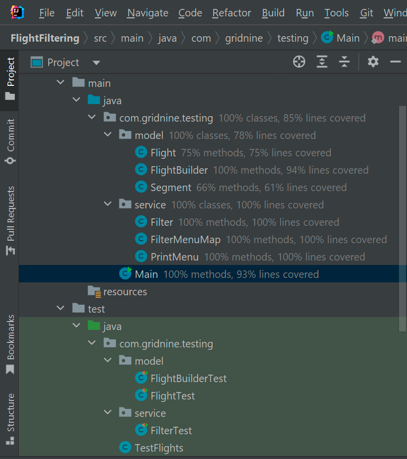

## FlightFiltering

Модуль для фильтрации перелётов.

Перелёт — это перевозка пассажира из одной точки в другую с возможными промежуточными посадками. Его можно представить как набор из одного или нескольких элементарных перемещений, называемых сегментами. 
Сегмент — это атомарная перевозка, которую будем характеризовать всего двумя атрибутами: дата/время вылета и дата/время прилёта.

Раелизовано три фильтра, исключающие из набора перелёты по следующим правилам:
вылет до текущего момента времени;
имеются сегменты с датой прилёта раньше даты вылета;
общее время, проведённое на земле превышает два часа.

Правила могут выбираться и задаваться динамически, с помощью меню, в консоли. Отфильтрованные перелёты также выводятся в консоль.
Предполагается, что модуль может расширяться, правил фильтрации может быть очень много. 
Также и наборы перелётов могут быть очень большими. 

Код покрыт тестами. 

